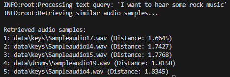
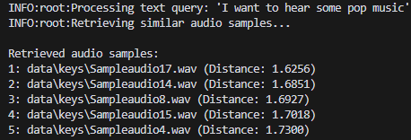
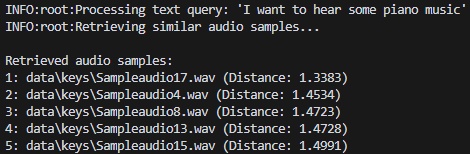

# Cross-Modal Retrieval Project

## Description
This project implements a cross-modal retrieval system that enables searching and retrieving information across different types of media, including text and images. It utilizes deep learning techniques to create a shared embedding space for multiple modalities, allowing for efficient and accurate retrieval of related content across different data types.

## Features
- Multi-modal embedding: Create a unified representation space for text and image data
- Scalable architecture: Will be designed to handle large-scale datasets efficiently
- Pre-trained models: Utilizes state-of-the-art pre-trained models for feature extraction
- Customizable: Easy to extend for additional modalities or fine-tune for specific domains

## Installation
1. Clone the repository:
   ```
   bash
   git clone https://github.com/your-username/cross-modal-retrieval.git
   cd cross-modal-retrieval
   ```
2. Install the required dependencies:
   ```
   pip install -r requirements.txt


## Outcome

Query: "I want to hear some rock music"



Query: "I want to hear some pop music"



Query: "I want to hear some piano music"



